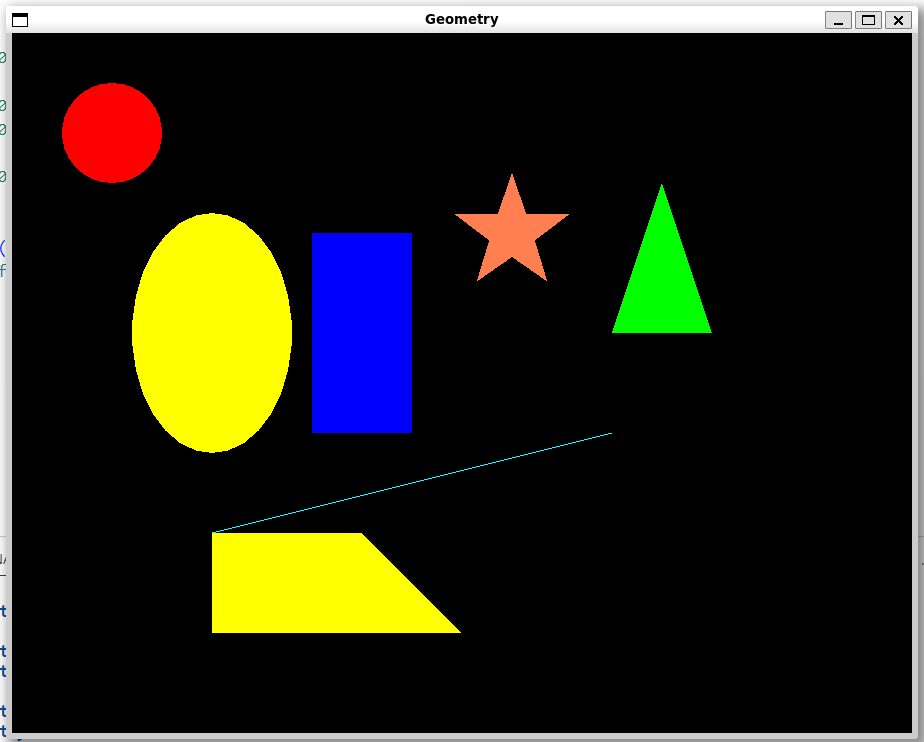

**Задача**:

Необходимо привести пример программы или библиотеки на C++, которая выводит на экран различные геометрические фигуры: круг, квадрат, треугольник, прямоугольник и т.п. 

**Запуск кода**:

`g++ -std=c++20  *.cpp -o main -lsfml-graphics -lsfml-window -lsfml-system`
`./main`

**Пример вывода программы**:

